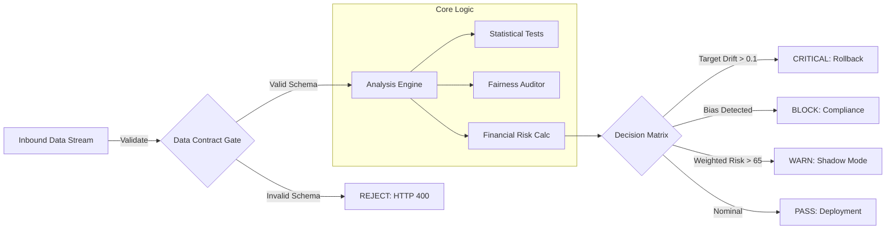

<div align="center">
  
  
  <h1>AI-model-quality-analyzer</h1>
  <h3>Production-Style ML Observability & Reliability System</h3>

  <!-- PROJECT STATUS -->
  <p>
    <a href="https://github.com/SalmaTech-03/Ai-model-quality-analyzer/actions">
      
    </a>
    <a href="https://github.com/SalmaTech-03/Ai-model-quality-analyzer/actions">
      
    </a>
    
    
  </p>

  <!-- CORE STACK -->
  <p>
    
    
    
    
  </p>

  <!-- DATA SCIENCE STACK -->
  <p>
    
    
    
    
  </p>

  <!-- QUALITY & TOOLS -->
  <p>
    
    
    
  </p>
</div>

---

## System Demonstration

<div align="center">
  <video src="demovideo.mp4" controls width="100%"></video>
  <p><em>Figure 1: Real-time drift analysis triggering the automated circuit breaker.</em></p>
</div>


*Figure 2: The ModelGuard Interface showing feature drift quantification.*

---

## Executive Summary

**AI-model-quality-analyzer** is an ML reliability control-plane that enforces data contracts, detects statistically significant drift, and executes deterministic remediation actions in production-style pipelines.

Rather than treating observability as a dashboarding problem, ModelGuard encodes failure-handling logic directly into the system: invalid data is rejected, biased models are blocked, and high-risk deployments are rolled back automatically.

This project demonstrates applied MLOps practices across data validation, model governance, statistical testing, and operational decisioning — the layers where real-world ML systems fail.


---

## Architectural Design

AI-model-quality-analyzer is implemented as an independent reliability control plane positioned between data ingestion and model inference.

This separation ensures that governance, drift detection, and remediation logic remain isolated from model code, enabling safer rollbacks, auditable decisions, and independent evolution of reliability policies without retraining models.



---

## Comparative Analysis

AI-model-quality-analyzer shifts the focus from observation to action.

| Feature | Traditional Monitoring | ModelGuard AI |
| :--- | :--- | :--- |
| **Logic Model** | Passive Observation | Active Deterministic Remediation |
| **Alerting** | Threshold-based Noise | Business-Impact Weighted |
| **Data Quality** | Post-Mortem Debugging | Pre-Ingestion Data Contracts |
| **Metrics** | Aggregate Drift Scores | Target-Aware Risk Scoring |
| **Governance** | Manual Review | Automated Fairness Circuit Breakers |

---

## Decision Matrix & Automated Governance

The platform converts statistical signals into binary operational actions using the following logic gates:

| Signal Severity | Trigger Condition | System Action | Operational Impact |
| :--- | :--- | :--- | :--- |
| **CRITICAL** | `Target Drift > 0.1` | **ROLLBACK** | Immediate traffic termination to prevent invalid inference. |
| **HIGH** | `DIR < 0.8` | **BLOCK** | Deployment halted due to violation of 4/5ths fairness rule. |
| **MEDIUM** | `Risk Score > 65` | **SHADOW** | Traffic routed to canary model for parallel evaluation. |
| **LOW** | `Contract Violation` | **REJECT** | Ingestion API returns 400 Error to upstream producer. |

---

## Financial Risk Quantification

AI-model-quality-analyzer translates technical drift metrics into estimated financial impact using a heuristic cost-basis model.

$$ \text{Revenue Risk} = \text{Volume} \times \text{AvgCost} \times (\alpha \cdot D_{feature} + \beta \cdot D_{target}) $$

**Where:**
*   **Volume**: Throughput of the current batch.
*   **AvgCost**: Business cost of a False Prediction ($150.00).
*   **D**: Drift Score (0.0 - 1.0).
*   **Alpha/Beta**: Correlation coefficients for feature vs. target drift.
### Example: For a batch of 10,000 predictions with a 0.25 target drift score, the estimated revenue risk exceeds $375,000, triggering automatic rollback.
---

## Technology Stack

| Component | Technology | Role |
| :--- | :--- | :--- |
| **API Server** | `FastAPI` + `Uvicorn` | High-concurrency asynchronous ingestion. |
| **Validation** | `Pydantic` | Strict schema enforcement and type checking. |
| **Computation** | `SciPy` + `NumPy` | Kolmogorov-Smirnov tests and P-Value calculation. |
| **Drift Detection** | `Evidently AI` | Statistical profiling and distance measurement. |
| **State Store** | `SQLite` | Audit logging, versioning, and cooldown management. |
| **Frontend** | `Vanilla JS` + `CSS3` | Lightweight, dependency-free visualization layer. |

---

## System Boundaries & Guarantees

### ModelGuard is intentionally designed as a reliability and governance layer rather than a full inference-serving system.

The platform guarantees:
- Validated, schema-safe data ingestion
  
- Statistically justified drift detection
  
- Deterministic and explainable remediation decisions
  

Inference latency optimization and online serving are intentionally out of scope to preserve auditability, safety, and statistical rigor.


---

## Deployment & Usage

### Local Initialization

```bash
# 1. Clone Repository
git clone https://github.com/SalmaTech-03/Ai-model-quality-analyzer.git

# 2. Setup Environment
python -m venv venv
source venv/bin/activate
pip install -r requirements.txt

# 3. Hydrate Data
python scripts/download_data.py

# 4. Launch Service
uvicorn app.main:app --reload
```

### Docker Execution

```bash
docker-compose up --build
```

### SQL Analyst Interface
AI-model-quality-analyzer exposes an embedded SQL engine for root-cause analysis on ingested batches.

**Endpoint:** `POST /api/sql`
```sql
SELECT occupation, COUNT(*) as volume
FROM current_table
WHERE income = '>50K'
GROUP BY occupation
ORDER BY volume DESC
LIMIT 5;
```

---

## Project Structure

```text
├── app/
│   ├── api/            # API Route Definitions
│   ├── core/           # Mathematical & Logic Engines
│   ├── static/         # Dashboard Assets
│   └── main.py         # App Entry Point
├── data/               # Local Data Storage
├── tests/              # Pytest Suite
├── docker-compose.yml  # Container Orchestration
└── requirements.txt    # Dependency Manifest
```

---

## MLOps Practices Demonstrated

##### - Data Contracts enforced via strict Pydantic schemas
##### - Automated drift detection with statistical significance testing (KS test, p-values)
##### - Model governance via fairness constraints (Disparate Impact Ratio)
##### - Deployment safety through circuit breakers and rollback logic
##### - Reproducible environments using Docker and pinned dependencies
##### - Auditable state and decisions persisted in a relational store


<div align="center">
  <p><strong>Developed by Salma S</strong></p>
  <p>ML Engineering / MLOps Systems Project</p>
</div>
```
